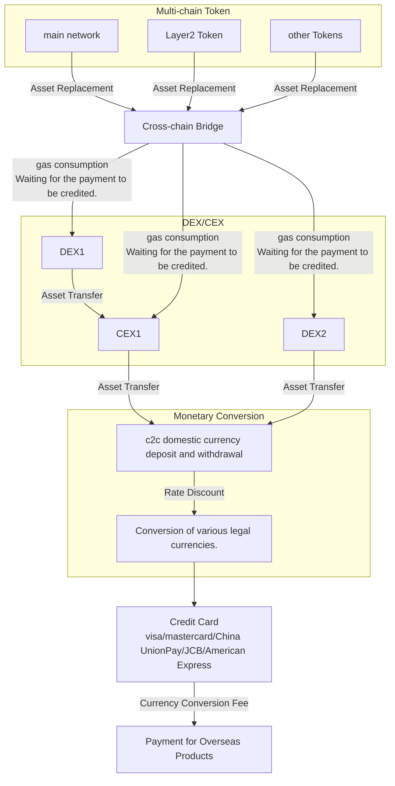
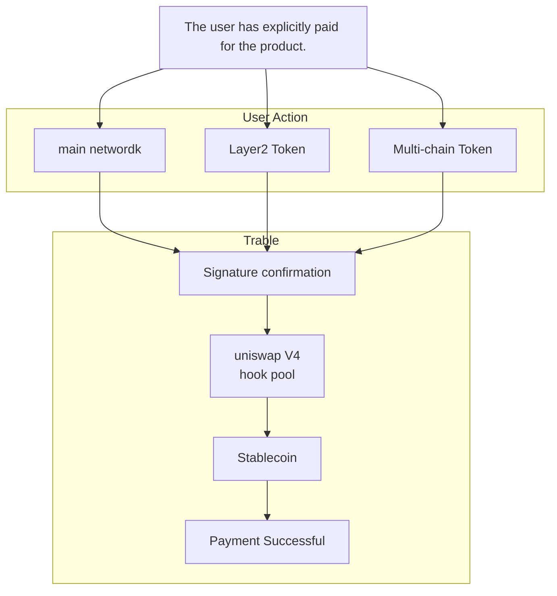

<h1 align="center">
  Trable
</h1>

<h1 align="center">
  
</h1>

<h2 align="center">
  Enable pay in travel without trouble.
</h2>

<h1 align="center">
  
</h1>

### English | [中文](https://github.com/Web3-Club/Trable/blob/main/docs/README_CN.md)

## Introduction

With the growing Web3 ecosystem, more and more people are entering the Web3 industry, leading to an increasing number of individuals using cryptocurrencies for payments of products and services. However, the process of completing a purchase has become cumbersome, especially when it involves overseas products, requiring multiple asset conversions. This process is time-consuming and incurs high costs.

Traditional crypto payment process for overseas travel products:

Cryptocurrency - DEX - CEX - Fiat currency - Foreign fiat currency payment

### 流程图演示

### Drawbacks:
• ❌ DEX conversion friction costs
• ❌ CEX transaction fees
• ❌ Currency conversion loss during withdrawal
• ❌ Currency conversion fees for foreign money payments

#### Trable想要做到的

- ✅ 一步签名即到位 仅收取较少费用

对此我们的项目提出解决方案，优化资产转换流程，提升用户在Web3的体验。

并且后疫情时代，旅游业蓬勃发展，Trable进入这个庞大的市场，旨在提供独特的价值主张。

### 项目介绍｜Project Introduction

Trable是一款针对加密货币支付的境外旅游产品Dapp应用。

此应用通过集成Uniswap V4 等技术，依靠Polkadot生态中的Acala、Moonbean平台,有效地简化了用户使用加密货币订购境外旅游产品的流程，缩减消费者的所需时间 及降低DEX/CEX货币转换的成本。

用户仅需选择所需的支付加密货币并完成签名，即可轻松在本Dapp预订境外旅游产品。我们解决了个人外汇额度限制和支付工具不足的问题，提供了必要的法币支付支持。同时，我们在链上实时监控资金流向，确保资金安全。在整个过程中，只会收取一次手续费，为用户的订购体验提供全面保障。

---

Trable is an overseas travel product Dapp application for cryptocurrency payment.

This application integrates Uniswap V4 and other technologies and relies on the Acala and Moonbean platforms in the Polkadot ecosystem to effectively simplify the process for users to order overseas travel products using cryptocurrency, shorten the time required for consumers and reduce the cost of DEX/CEX currency conversion. .

Users only need to select the required payment password and complete the signature to easily book overseas travel products on this Dapp. We have solved the problems of personal foreign exchange limit limits and insufficient payment tools, and provided necessary legal currency payment support. At the same time, we monitor the flow of funds in real time on the chain to ensure the safety of funds. During the entire process, only one handling fee will be charged, providing comprehensive protection for users’ ordering experience.

 

### 基本技术架构｜Basic technical architecture

#### Uniswap V4

在Uniswap V3中，给每个流动性资金池部署单独的合约，这样创建资金池和执行多池兑换的成本更高。

Uniswap V4将所有资金池都存储在一个合约中，从而节省了大量的燃料成本，因为兑换将不再需要在不同的合约中的资金池之间转移代币。

In Uniswap V3, each liquidity pool is deployed with its own individual contract, resulting in higher costs for creating pools and executing multi-pool exchanges.

Uniswap V4 consolidates all liquidity pools into a single contract, thereby saving significant gas costs. This is because exchanges will no longer require the transfer of tokens between pools in different contracts.

<h1 align="center">
  
</h1>

#### Solidity
为了是项目构建在Uniswap V3上 实现未来对于Uniswap V4的支持 我们在项目合约上使用了Solidity语言 对项目进行了构建

### 前端

项目前端仓库:[Trable-froutend](https://github.com/Web3-Club/Trable-frontend)

[Demo](https://trable-fe.vercel.app/)

### Key Dapp Features

- Support for fiat currency payments（支持法币支付）

确保旅游产品跨境crypto直接支付的便利性

- Fast transactions anytime, anywhere（随时随地、快速交易）

简化虚拟货币转移过程（多链资产转换）

- Save time and effort, lower loss（省时省力、更低损耗）

结合Uniswap V4 降低多种token的swap成本，减少不必要的原始资产的转换和支付磨损

- No need to consider personal foreign exchange restrictions（无需考虑个人外汇限制）

不受传统银行外汇限额的影响，更流畅的旅行体验

### Project demo

## 测试

项目包含了针对合约功能的测试用例，确保了各项功能的正确性和安全性。

## 队员信息

GitHub:
[@yanboishere](https://github.com/yanboishere)
[@s7iter](https://github.com/s7iter)
[@Jerry](https://github.com/Web3-Jerry)
[@zijin79](https://github.com/zijin79)

## Contect

