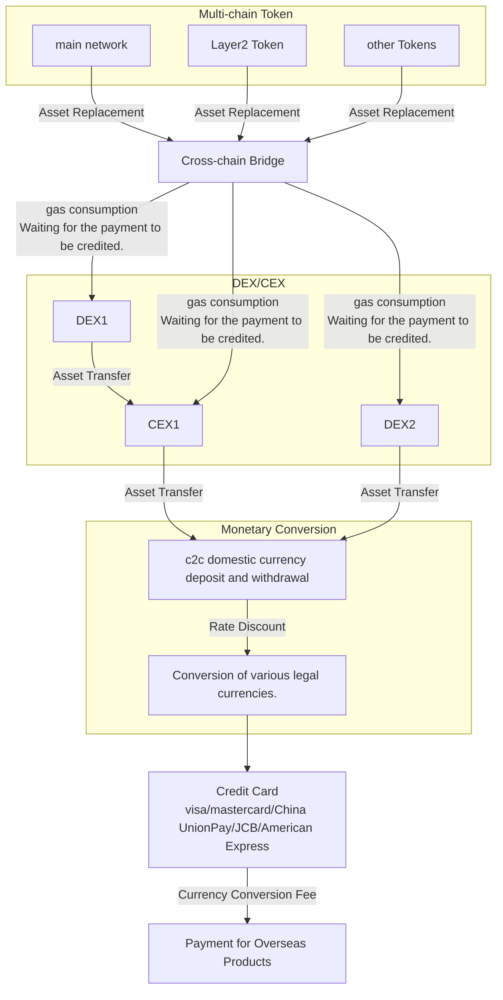
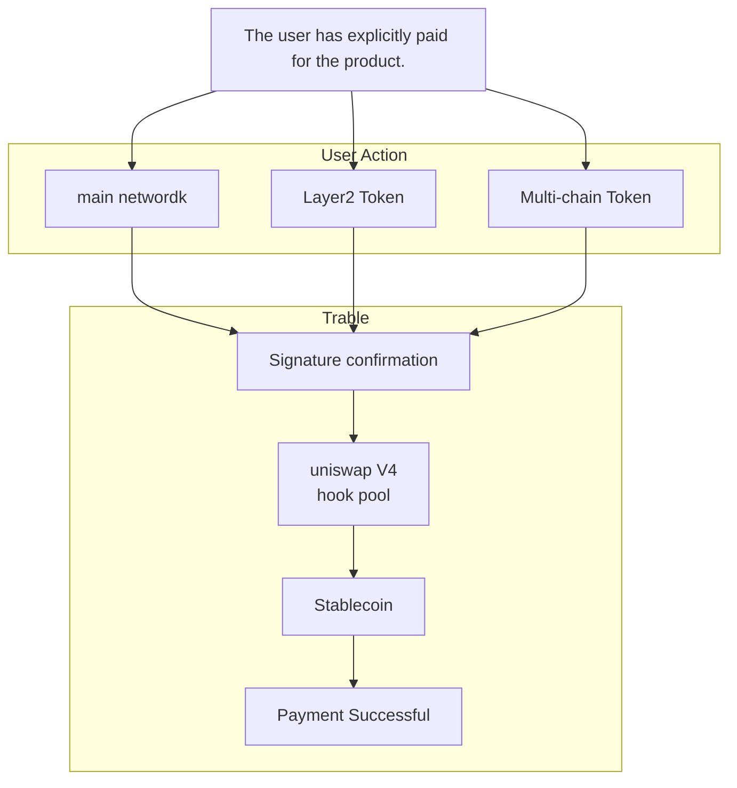

<h1 align="center">
  <span style="font-size: 32px;">Trable</span>
</h1>

<h1 align="center">
  
</h1>

<h2 align="center">
  Enable pay in travel without trouble.
</h2>


<h1 align="center">
  
</h1>


### English | [中文](https://github.com/Web3-Club/Trable/blob/main/docs/README_CN.md)


## Introduction

With the growing Web3 ecosystem, more and more people are entering the Web3 industry, leading to an increasing number of individuals using cryptocurrencies for payments of products and services. However, the process of completing a purchase has become cumbersome, especially when it involves overseas products, requiring multiple asset conversions. This process is time-consuming and incurs high costs.

Traditional crypto payment process for overseas travel products:

    Cryptocurrency - DEX - CEX - Fiat currency - Foreign fiat currency payment


### Flowchart Demo





### Drawbacks:
- ❌ DEX conversion friction costs
- ❌ CEX transaction fees
- ❌ Currency conversion loss during withdrawal
- ❌ Currency conversion fees for foreign money payments


Trable's Objective:
- ✅ One-step signing, minimal fees





To address these challenges, our project proposes a solution that optimizes the asset conversion process and enhances users' Web3 experience. In the post-pandemic era, the travel industry is thriving, and Trable aims to enter this vast market by offering unique value propositions.


### Project Introduction

Trable is an overseas travel product Dapp application for cryptocurrency payment.

This application integrates Uniswap V4 and other technologies and relies on the Acala and Moonbean platforms in the Polkadot ecosystem to effectively simplify the process for users to order overseas travel products using cryptocurrency, shorten the time required for consumers and reduce the cost of DEX/CEX currency conversion. .

Users only need to select the required payment password and complete the signature to easily book overseas travel products on this Dapp. We have solved the problems of personal foreign exchange limit limits and insufficient payment tools, and provided necessary legal currency payment support. At the same time, we monitor the flow of funds in real time on the chain to ensure the safety of funds. During the entire process, only one handling fee will be charged, providing comprehensive protection for users’ ordering experience.

<br>

### Basic technical architecture

#### Trable asset router
The Trable Asset Router, based on Acala asset router, integrated with XCM, provides users with a seamless and secure solution for transferring Polkadot-related assets to the EVM ecosystem, specifically targeting the use case of paying travel fees with DOT. By following the outlined six-step process, users can easily initiate and complete asset transfers, leveraging the capabilities of the Acala and Wormhole protocols, along with the cross-chain communication facilitated by XCM.
#### How it works?
We aim to help users who want to pay their travel fee directly through polka related asset like DOT. Thus transfering polka asset from parachain to USDC on EVM is our primary target. 

We utilize acala asset router to achieve the target. The following 6 steps describe how it works in detail.

1. In our front page, users only need to select the source and target chains, as well as the token to transfer. As we can see in the demo video. Our web extension will save order information and jump to trable payment page.
2. The second step is get a router address on karura network. In our project, we will send a shoudRounteWormhole request. 
3. We will pop a signature request that prompts users to sign a transtraction from parachain to karura chain
4. After the signature, we will send tokens to wormhole. In our code, the routeWormhole will achieve this.
5. After send the  token, router will be listening and waiting for VAA. After fetch it, the router interact with wormhole core contract。
6. At the final step, user will sign a transaction with MetaMask that redeems the token on the target EVM chain.

#### cross chain code analyze
Most of token transfer on Trable is `parachain -> EVM`, Thus we mainly use wormhole proctool.
Here is cross chain tranfer code in `WormholeRouter.sol`
``` solidity
function routeImpl(ERC20 token) internal override {
        bool approved = token.approve(_tokenBridgeAddress, token.balanceOf(address(this)));
        require(approved, "WormholeRouter: approve failed");

        ITokenBridge(_tokenBridgeAddress).transferTokens(
            address(token),
            token.balanceOf(address(this)),
            _instructions.recipientChain,
            _instructions.recipient,
            _instructions.arbiterFee,
            _instructions.nonce
        );
  }
```
`ITokenBridge` is the core of cross chain, you could find it in 
https://github.com/Web3-Club/wormhole/blob/main/ethereum/contracts/bridge/interfaces/ITokenBridge.sol

#### Uniswap V4

In Uniswap V3, each liquidity pool is deployed with its own individual contract, resulting in higher costs for creating pools and executing multi-pool exchanges.

Uniswap V4 consolidates all liquidity pools into a single contract, thereby saving significant gas costs. This is because exchanges will no longer require the transfer of tokens between pools in different contracts.


<h1 align="center">
  
</h1>


### Solidity

- The project is built on Uniswap V3 to ensure future support for Uniswap V4. We utilized the Solidity for the project's smart contracts.


###  Frontend

Project frontend repository:[Trable-froutend](https://github.com/Web3-Club/Trable-frontend)

[Demo](https://trable-fe.vercel.app/)

## Key Dapp Features

- Support for fiat currency payments


- Fast transactions anytime, anywhere


- Save time and effort, lower loss


- No need to consider personal foreign exchange restrictions


## Testing
The project includes test cases for contract functionality, ensuring the correctness and security of each feature.


## Project demo

### Video
https://youtu.be/ujFpy4i8USQ


## Member

GitHub:
[@yanboishere](https://github.com/yanboishere)
[@s7iter](https://github.com/s7iter)
[@Jerry](https://github.com/Web3-Jerry)
[@zijin79](https://github.com/zijin79)

## Contect

[](https://twitter.com/Web3ClubCN)
[](https://t.me/Web3ClubCN)
[](mailto:web3clubCN@outlook.com)

